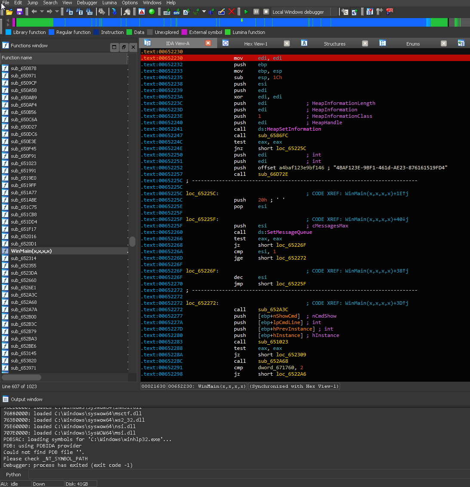
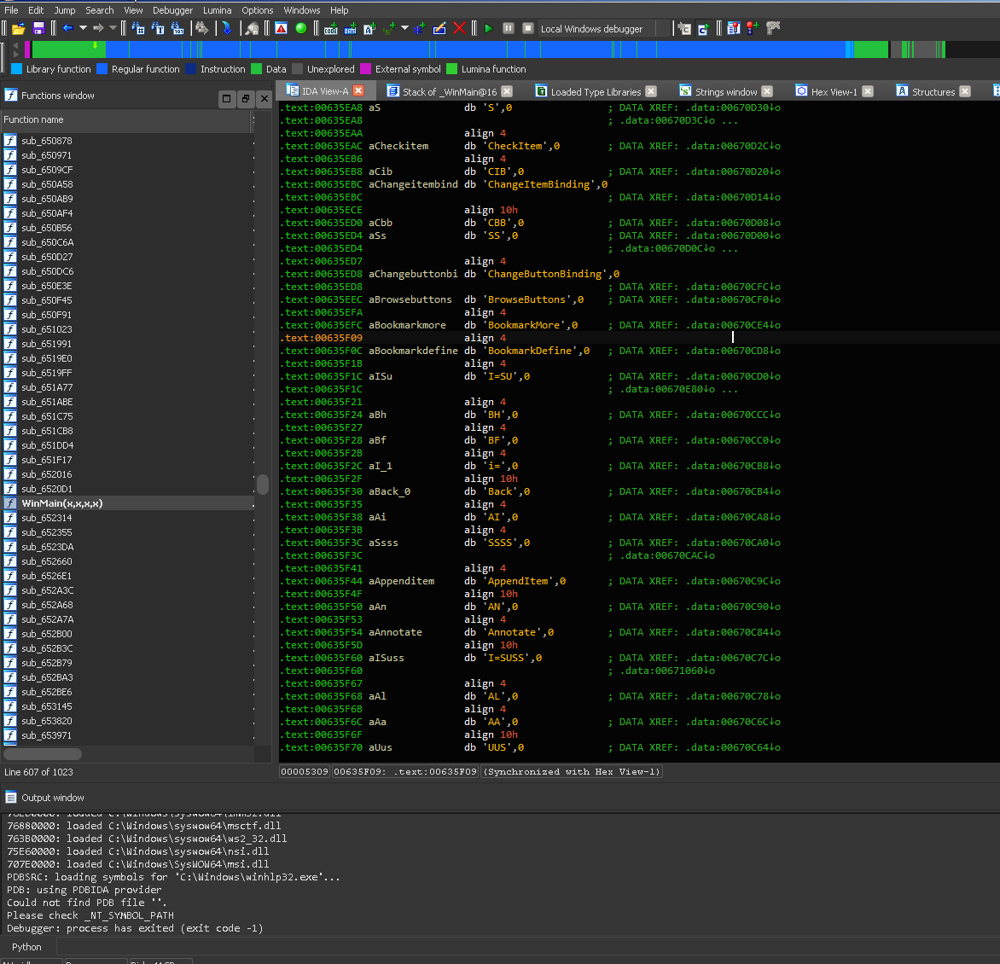
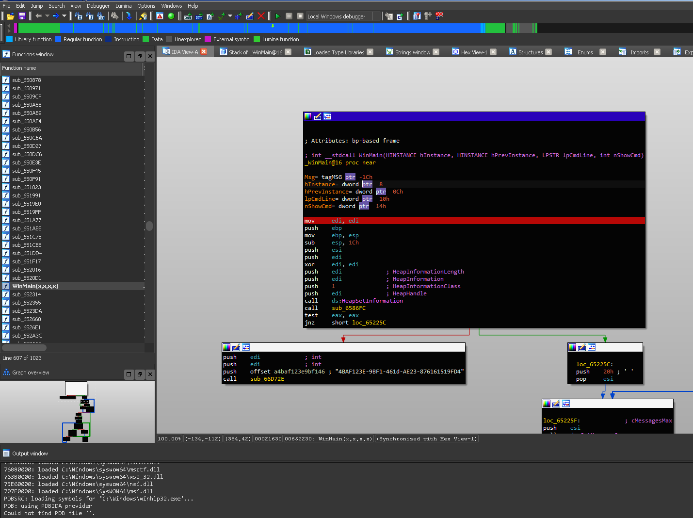
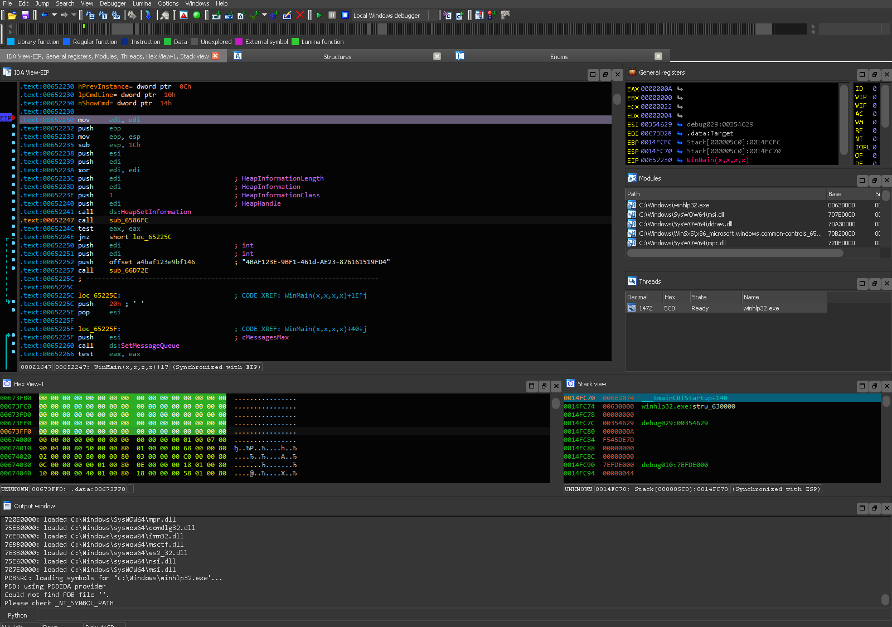

# IDA - Nightfall
A dark color theme for IDA Pro

*Forked from [h0xItx/ida_nightfall](https://github.com/0xItx/ida_nightfall)*

## Screnshots









## Installation
### >= 7.3 Linux
* `mkdir -p ~/.idapro/themes/nightfall && wget "https://raw.githubusercontent.com/av-gantimurov/ida_nightfall/master/theme.css" -O ~/.idapro/themes/nightfall/theme.css`

### >= 7.3 Windows
```powershell
mkdir "%APPDATA%\Hex-Rays\IDA Pro\themes\nightfall"
Invoke-Webrequest -Uri "https://raw.githubusercontent.com/av-gantimurov/ida_nightfall/master/theme.css" -Outfile "%APPDATA%\Hex-Rays\IDA Pro\themes\nightfall\theme.css"
```

### Older versions
* `wget "https://raw.githubusercontent.com/av-gantimurov/ida_nightfall/master/ida_nightfall.clr"`
* Options -> Colors -> Import
